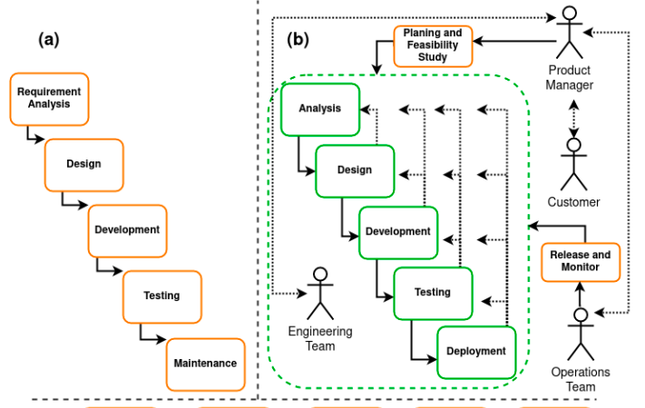

# Actividad 1 - CC3S2

**Nombre**: Mora Evangelista, Fernando Fausto

**Fecha**: 01-09-2025

**Contexto del entorno**: El desarrollo de la actividad se realizó en un equipo con Linux Mint 22.1, utilizando Visual Studio Code para editar los archivos Markdown y la plataforma GitHub para gestionar el repositorio.

### 4.1 DevOps vs. cascada tradicional
Agrega una imagen comparativa en imagenes/devops-vs-cascada.png. Puede ser un diagrama propio sencillo.

Explica por qué DevOps acelera y reduce riesgo en software para la nube frente a cascada (feedback continuo, pequeños lotes, automatización).

Pregunta retadora: señala un contexto real donde un enfoque cercano a cascada sigue siendo razonable (por ejemplo, sistemas con certificaciones regulatorias estrictas o fuerte acoplamiento hardware). Expón dos criterios verificables y los trade-offs (velocidad vs. conformidad/seguridad).
Qué se validará: que tu imagen muestre ciclos de feedback y no solo "cajas", que cites al menos una fuente seria.

La siguiente imagen compara los enfoques de desarrollo de software en cascada tradicional y DevOps:

