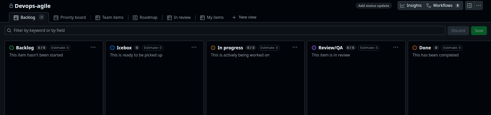
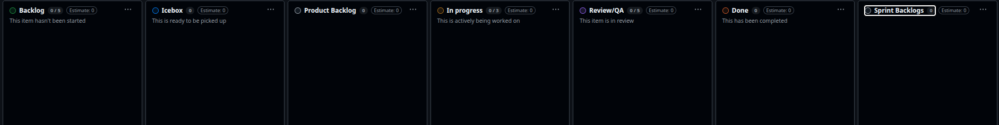
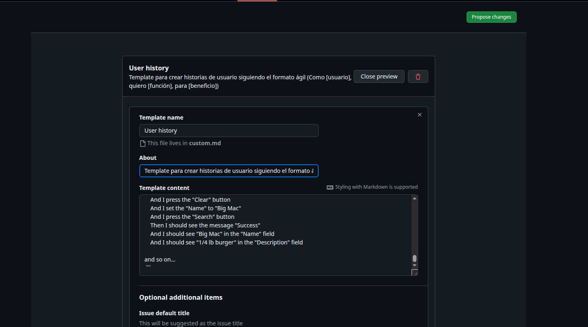
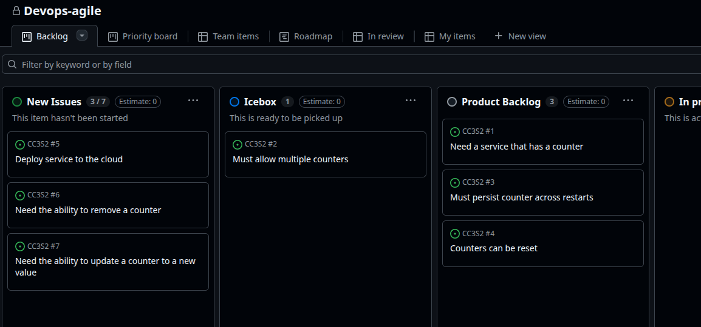

### Parte 1
Tablero kanban

Tablero final

### Parte 2

Configuración del template

-> [Enlace al template](https://github.com/fausto-e/CC3S2/blob/main/.github/ISSUE_TEMPLATE/user-history.md)

### Parte 3

Límite de 7  en New issues y Issues en sus columnas correspondientes.

### Parte 4

technical debt marca     aquellas historias que no aportan valor visible al cliente pero deben completarse para continuar con el desarrollo.