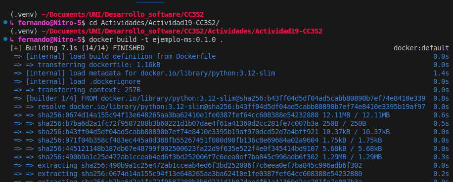
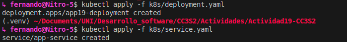
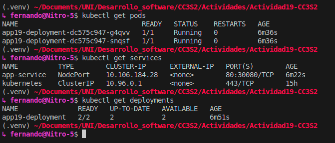
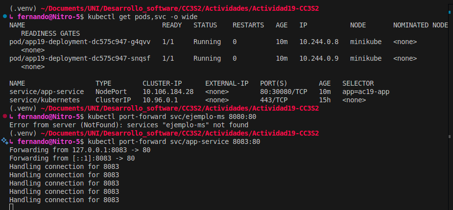
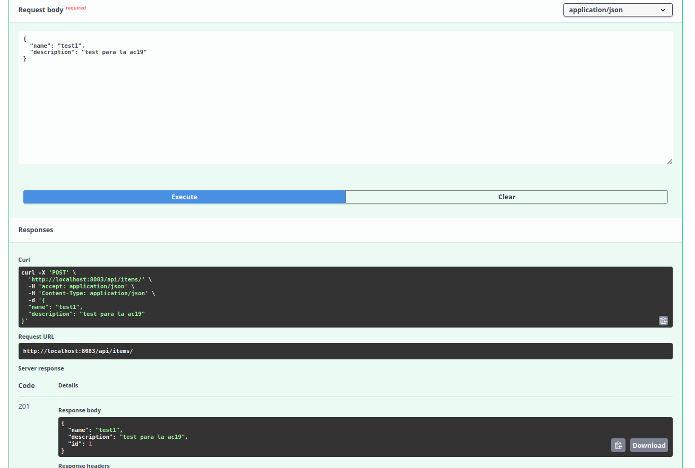
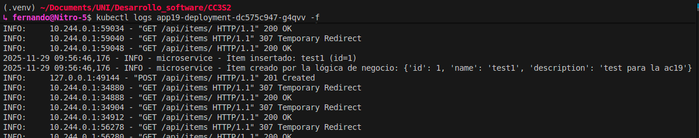

### Construccion de imagen en minikube

### Aplicamos los manifiestos en `k8s/`

### Observamos los recursos creados

### Probamos el servicio

port-forwarding

Mandamo la solicitud al servicio

Verificamos los logs del pod

