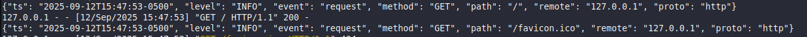
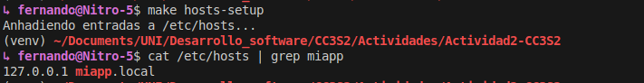
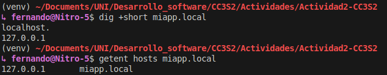
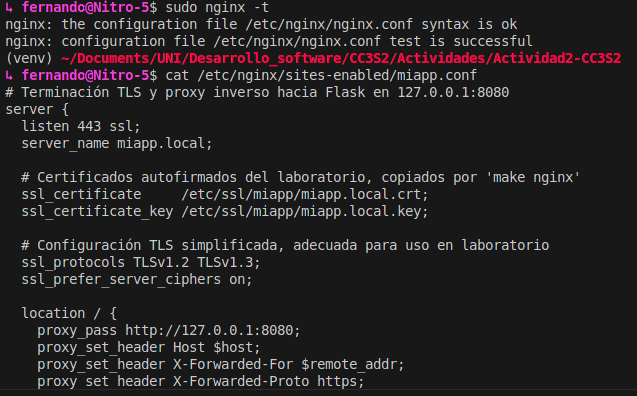
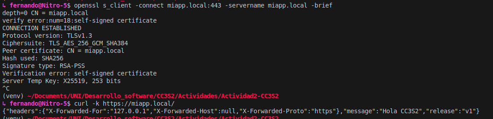
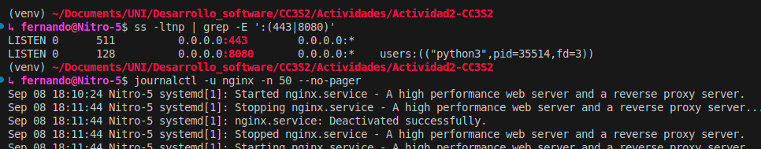
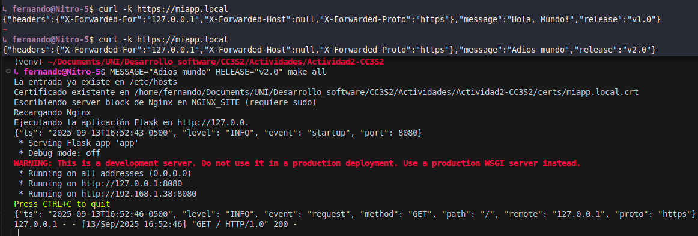
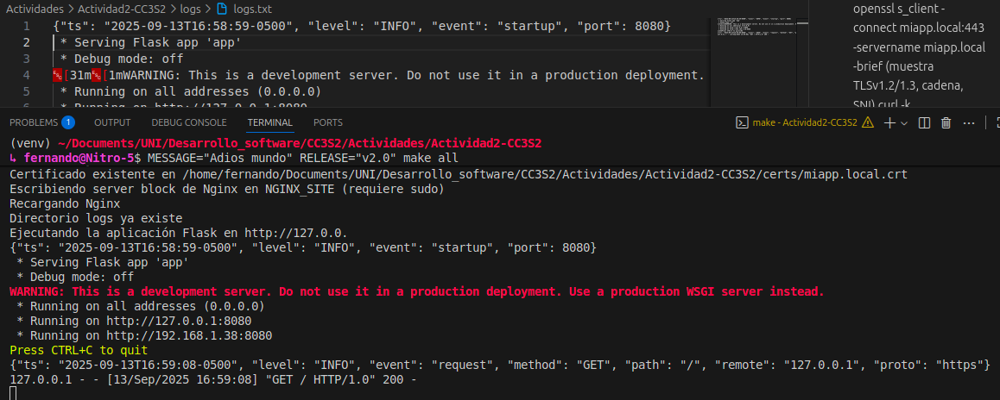

# Resolución de la Actividad 2
### 1 HTTP: Fundamentos y herramientas
#### 1.1 Reporte de salida stdout de la aplicación Flask

```shell
(venv) ~/Documents/UNI/Desarrollo_software/CC3S2/Actividades/Actividad2-CC3S2
↳ fernando@Nitro-5$ PORT=8080 MESSAGE="Hola CC3S2" RELEASE="v1" python3 miapp/app.py
{"ts": "2025-09-12T15:47:40-0500", "level": "INFO", "event": "startup", "port": 8080}
 * Serving Flask app 'app'
 * Debug mode: off
WARNING: This is a development server. Do not use it in a production deployment. Use a production WSGI server instead.
 * Running on all addresses (0.0.0.0)
 * Running on http://127.0.0.1:8080
 * Running on http://192.168.1.38:8080
Press CTRL+C to quit
{"ts": "2025-09-12T15:47:53-0500", "level": "INFO", "event": "request", "method": "GET", "path": "/", "remote": "127.0.0.1", "proto": "http"}
127.0.0.1 - - [12/Sep/2025 15:47:53] "GET / HTTP/1.1" 200 -
{"ts": "2025-09-12T15:47:53-0500", "level": "INFO", "event": "request", "method": "GET", "path": "/favicon.ico", "remote": "127.0.0.1", "proto": "http"}
127.0.0.1 - - [12/Sep/2025 15:47:53] "GET /favicon.ico HTTP/1.1" 404 -
{"ts": "2025-09-12T15:48:45-0500", "level": "INFO", "event": "request", "method": "GET", "path": "/notfound", "remote": "127.0.0.1", "proto": "http"}
127.0.0.1 - - [12/Sep/2025 15:48:45] "GET /notfound HTTP/1.1" 404 -
```

#### 1.2 Inspección con curl

- `curl -v http://127.0.0.1:8080/` (cabeceras, código de estado, cuerpo JSON)

```shell
*   Trying 127.0.0.1:8080...
* Connected to 127.0.0.1 (127.0.0.1) port 8080
> GET / HTTP/1.1
> Host: 127.0.0.1:8080
> User-Agent: curl/8.5.0
> Accept: */*
> 
< HTTP/1.1 200 OK
< Server: Werkzeug/3.1.3 Python/3.12.3
< Date: Fri, 12 Sep 2025 20:52:37 GMT
< Content-Type: application/json
< Content-Length: 124
< Connection: close
< 
{"headers":{"X-Forwarded-For":null,"X-Forwarded-Host":null,"X-Forwarded-Proto":null},"message":"Hola CC3S2","release":"v1"}
* Closing connection
```

> Podemos apreciar las cabeceras HTTP: Server, Date, Content-Type, Content-Length, el código de estado 200 OK y el cuerpo JSON con el mensaje, release y headers.

- `curl -i -X POST http://127.0.0.1:8080`

```shell
HTTP/1.1 405 METHOD NOT ALLOWED
Server: Werkzeug/3.1.3 Python/3.12.3
Date: Fri, 12 Sep 2025 21:00:16 GMT
Content-Type: text/html; charset=utf-8
Allow: OPTIONS, GET, HEAD
Content-Length: 153
Connection: close

<!doctype html>
<html lang=en>
<title>405 Method Not Allowed</title>
<h1>Method Not Allowed</h1>
<p>The method is not allowed for the requested URL.</p>
```
> Aquí podemos observar el código de estado 405 METHOD NOT ALLOWED, indicando que el método POST no está permitido en la ruta `/`.

- Pregunta guía: ¿Qué campos de respuesta cambian si actualizas MESSAGE/RELEASE sin reiniciar el proceso? Explica por qué.

> Al actualizar las variables de entorno MESSAGE y RELEASE sin reiniciar el proceso, los campos en la respuesta JSON no cambian. Esto se debe a que las variables de entorno son leídas por la aplicación Flask al momento de su ejecución.

#### 1.3 Puertos abiertos con `ss`

- `ss -ltnp | grep :8080`

```shell
↳ fernando@Nitro-5$ ss -ltnp | grep :8080
LISTEN 0      128          0.0.0.0:8080       0.0.0.0:*    users:(("python3",pid=35514,fd=3))
```

> Se aprecia como el proceso `python3` está escuchando en el puerto 8080 en todas las interfaces del sistema.

#### 1.4 Logs como flujo: Demuestra que los logs salen por stdout (pega 2–3 líneas). Explica por qué no se escriben en archivo (12-Factor).

> En la siguiente captura de pantalla se observa la salida de logs en la terminal donde se ejecuta la aplicación Flask:



Estos mensajes se imprimen en **stdout** (flujo de salida estándar).  
Por defecto, `stdout` está asociado a la terminal, por lo que los logs aparecen directamente allí.  
La aplicación no escribe en archivos locales, sino que delega al entorno (Docker, systemd, Kubernetes, etc.) la captura y persistencia de los logs, siguiendo el principio de 12-Factor App.

### 2 DNS: nombres, registros y caché

#### 2.1 Hosts local
> Use el target hosts-setup del Makefile para añadir las entradas necesarias en /etc/hosts.



#### 2.2 Comprueba resolución



#### 2.3 TTL/caché
```
;example.com.                   IN      A

;; ANSWER SECTION:
example.com.            3m42s   IN      A       23.220.75.245
example.com.            3m42s   IN      A       23.192.228.80
example.com.            3m42s   IN      A       23.192.228.84
example.com.            3m42s   IN      A       23.215.0.136
example.com.            3m42s   IN      A       23.215.0.138
example.com.            3m42s   IN      A       23.220.75.232

;; Query time: 6 msec
;; SERVER: 127.0.0.53#53(127.0.0.53) (UDP)
;; WHEN: Fri Sep 12 21:24:36 -05 2025
;; MSG SIZE  rcvd: 136
```

> El TTL indica cuánto tiempo los resolutores pueden cachear esa respuesta antes de volver a preguntarle a un servidor autoritativo.

**¿Qué diferencia hay entre /etc/hosts y una zona DNS autoritativa?**

`/etc/hosts` es un archivo local que mapea nombres de dominio a IPs sin depender de un servidor.
Una zona DNS autoritativa es la fuente oficial en internet de los registros de un dominio.
`/etc/hosts` es útil en este laboratorio porque permite mapear un dominio (miapp.local) a una IP (127.0.0.1) sin tener que registrar un dominio ni configurar un servidor DNS.

### 3 TLS: seguridad en tránsito con Nginx como reverse proxy

- Certificado de laboratorio: genera autofirmado (usa el target make tls-cert si existe) y coloca crt/key donde lo espera Nginx (ver guía).

> Proceso guardado en el Makefile con el target `tls-cert`.

- Configura Nginx: usa el ejemplo provisto para terminación TLS y proxy_pass a http://127.0.0.1:8080 con cabeceras X-Forwarded-*. Luego nginx -t y reinicia el servicio. Incluye el snippet clave de tu server en el reporte.


- Valida el handshake:

openssl s_client -connect miapp.local:443 -servername miapp.local -brief (muestra TLSv1.2/1.3, cadena, SNI).curl -k https://miapp.local/ (explica el uso de -k con certificados autofirmados).



> -k omite la verificación del certificado, útil para certificados autofirmados.

**Puertos y logs con evidencias de ambos sockets**



### 12-Factor App
2. config por entorno: variables de entorno MESSAGE, RELEASE


3. Los logs no se configuran en la app porque el entorno se debe encargar (systemd, Docker, etc.) segun las practicas de 12-Factor App.


- **HTTP: explica idempotencia de métodos y su impacto en retries/health checks. Da un ejemplo con curl -X PUT vs POST.**
Idempotencia es ejecutar el mismo request varias veces y no cambiar el resultado. Tenemos como ejemplo de métodos idempotentes a GET, PUT, DELETE y no idempotente a POST. Cuando un cliente, un load balancer o un health checker repite la petición, los métodos idempotentes no causan efectos secundarios no deseados.

- **DNS: ¿por qué hosts es útil para laboratorio pero no para producción? ¿Cómo influye el TTL en latencia y uso de caché?**
El archivo hosts es útil en laboratorio porque permite mapear un dominio a una IP local de forma manual y rápida, pero en producción se requiere DNS para que los clientes puedan resolver el dominio. El TTL en DNS influye en la latencia y el uso de caché: a mayor TTL, mejor latencia y menos consultas gracias al caché.

- **TLS: ¿qué rol cumple SNI en el handshake y cómo lo demostraste con openssl s_client?**
El SNI permite que un servidor presente diferentes certificados TLS según el nombre del host solicitado por el cliente. Se demostró con openssl s_client usando la opción `-servername  miapp.local`.

- **12-Factor: ¿por qué logs a stdout y config por entorno simplifican contenedores y CI/CD?**
Los logs a stdout/stderr permiten que el entorno de ejecución se encargue de recolectarlos e integrarlos con sistemas externos, evitando gestión manual en la app. La configuración en variables de entorno simplifica CI/CD porque desacopla el código de la config, permitiendo usar la misma imagen de contenedor en distintos entornos sin reempaquetar.

- **Operación: ¿qué muestra ss -ltnp que no ves con curl? ¿Cómo triangulas problemas con journalctl/logs de Nginx?**
`ss -ltnp`  muestra procesos y sockets en escucha, mientras que `curl` prueba la respuesta HTTP del servicio. con `ss` verifico los puertos de mi app, con `curl` verfico la conexión HTTP. Si hay problemas, uso `journalctl -u nginx` para ver logs de Nginx en busca de errores.