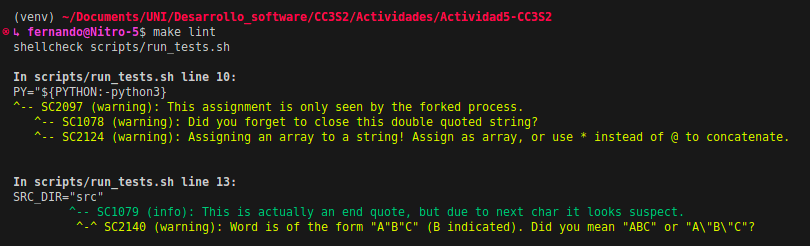
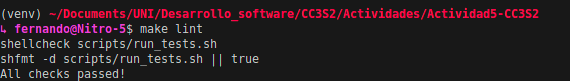
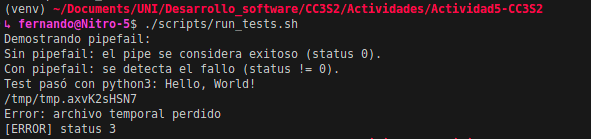

### Ejercicios parte 1
***
#### Ejercicio 1

El target `help` imprime documentatación sobre los targets definidos en el Makefile usando `grep`y `awk`.

`.DEFAULT_GOAL` fuerza el target por defecto que se ejecutara al correr `make` sin argumentos.

`.PHONY` es una directiva que indica que un target no corresponde a un archivo. Siempre se ejecutará un target aún existiendo un archivo con ese nombre.

#### Ejercicio 2

**Primera ejecución**: El target build depende de `out/hello.txt`, pero como no existe lo construye ejecutando su receta.

**Segunda ejecución**: Ahora `out/hello.txt` sí existe. Compara la marca de tiempo del target `out/hello.txt` y su prerrequisito `src/hello.py`. Si el target es más reciente o igual que el prerrequisito se "está al día", de otra forma se regenera el target. En este caso el target es más reciente que el prerrequisito.

#### Ejercicio 3

- `-e` (**exit on error**): Si un comando falla el script se interrumpe inmediatamente
- `-u`: Usar una variable no definida causa error. No se expande a cadenas vacias.
- `-o pipefail`: en pipelines el exit status será el del primer comando que falle.
- `.DELETE_ON_ERROR`: Elimina el artefacto intermedio generado por un target que tuvo un error durante la construcción.

#### Ejercicio 4

- El primer fragmento hace un dry-run de  `build` y guarda la salida estándar en logs. Solo muestra los comandos que ejecutaría. Un dry-run se suele usar para inspeccionar un target sin realmente modificar archivos ni ejecutar comandos.

- El segundo fragmento ejecuta `build` en modo depuración: ejecuta y explica en detalle lo que se hace:
    - lee reglas y variables,
    - construye el grafo de dependencias,
    - compara marcas de tiempo,
    - decide si ejecutar o no una receta.

#### Ejercicio 5
En Make, cada regla define un target (archivo a generar) y sus dependencias (fuentes necesarias).

Si alguna dependencia es más reciente que el target, make considera al target “desactualizado” y lo regenera.

Al hacer touch src/hello.py, ese archivo fuente queda más nuevo que out/hello.txt, por lo que make ejecuta la receta para actualizar el target.

En cambio, al hacer touch out/hello.txt, el target se vuelve más reciente que sus dependencias.

Como ya está “al día”, make detecta que no necesita rehacerlo y no ejecuta trabajo extra.

#### Ejercicio 6

ShellChec avisa que tu script no tiene shebang (#!/bin/bash o similar), por lo que no sabe qué shell asumir.

Sin esa información, las recomendaciones de ShellCheck podrían ser incorrectas (no es lo mismo sh que bash).

La sugerencia es agregar una línea inicial clara, por ejemplo: #!/usr/bin/env bash.

El diff mostrado (+) indica que shfmt detectó un archivo vacío y sugiere al menos agregar contenido o el shebang.

#### Ejercicio 7

Hash resultante: `65bf3b7b9ee763dfd162884b0bfc3e543904bd842337b2a6b34d17f42a2ce413`

- `--sort=name` asegura que los archivos se empaqueten en orden alfabético, evitando diferencias por el listado del sistema de archivos.

- `--mtime=@0` fija la fecha de modificación de todos los archivos al epoch (1970-01-01 00:00:00 UTC).

- `--owner=0 --group=0 --numeric-owner` fuerza que todos los archivos tengan dueño y grupo numéricos consistentes, típicamente root:root.

- `gzip -n ` evita almacenar el nombre original del archivo y su marca de tiempo en la cabecera del .gz.

- En conjunto, estas opciones eliminan variabilidad entre builds, permitiendo generar archivos reproducibles idénticos bit a bit.

#### Ejercicio 8
Make distingue reglas de receta de dependencias y variables por la indentación: las líneas de receta deben empezar con un TAB, no espacios.

Esto permite a Make saber qué comandos ejecutar para un target y cuáles son solo definiciones o dependencias.

Si se coloca espacios en lugar de TAB, Make da un error como missing separator o recipe commences before first target.

Para diagnosticarlo rápido, se puede usar `cat -T Makefile_bad` para ver caracteres de tabulación (^I), o un editor que muestre tabs vs espacios.

#### Ejercicio sobre scripts/run_test.sh
Ejecución del ejercicio
```shell
~/Documents/UNI/Desarrollo_software/CC3S2/Actividades/Actividad5-CC3S2
↳ fernando@Nitro-5$ bash -x scripts/run_tests.sh
+ set -euo pipefail
+ IFS='
        '
+ umask 027
+ set -o noclobber
+ PY=python3
+ SRC_DIR=src
++ mktemp
+ tmp=/tmp/tmp.dCpFLlyH88
+ trap 'cleanup $?' EXIT INT TERM
+ echo 'Demostrando pipefail:'
Demostrando pipefail:
+ set +o pipefail
+ false
+ true
+ echo 'Sin pipefail: el pipe se considera exitoso (status 0).'
Sin pipefail: el pipe se considera exitoso (status 0).
+ set -o pipefail
+ false
+ true
+ echo 'Con pipefail: se detecta el fallo (status != 0).'
Con pipefail: se detecta el fallo (status != 0).
+ cat
+ check_deps
+ deps=('python3' 'grep')
+ local -a deps
+ for dep in "${deps[@]}"
+ command -v python3
+ for dep in "${deps[@]}"
+ command -v grep
+ run_tests src/hello.py
+ local script=src/hello.py
+ local output
++ python3 src/hello.py
+ output='Hello, World!'
+ echo 'Hello, World!'
+ grep -Fq 'Hello, World!'
+ echo 'Test pasó: Hello, World!'
Test pasó: Hello, World!
+ cleanup 0
+ rc=0
+ rm -f /tmp/tmp.dCpFLlyH88
+ '[' -f src/hello.py.bak ']'
+ exit 0
~/Documents/UNI/Desarrollo_software/CC3S2/Actividades/Actividad5-CC3S2
↳ fernando@Nitro-5$ bash -x scripts/run_tests.sh
+ set -euo pipefail
+ IFS='
        '
+ umask 027
+ set -o noclobber
+ PY=python3
+ SRC_DIR=src
++ mktemp
+ tmp=/tmp/tmp.Mjy1IJivUM
+ trap 'cleanup $?' EXIT INT TERM
+ echo 'Demostrando pipefail:'
Demostrando pipefail:
+ set +o pipefail
+ false
+ true
+ echo 'Sin pipefail: el pipe se considera exitoso (status 0).'
Sin pipefail: el pipe se considera exitoso (status 0).
+ set -o pipefail
+ false
+ true
+ echo 'Con pipefail: se detecta el fallo (status != 0).'
Con pipefail: se detecta el fallo (status != 0).
+ cat
+ check_deps
+ deps=('python3' 'grep')
+ local -a deps
+ for dep in "${deps[@]}"
+ command -v python3
+ for dep in "${deps[@]}"
+ command -v grep
+ run_tests src/hello.py
+ local script=src/hello.py
+ local output
++ python3 src/hello.py
+ output='Helloo, World!'
+ echo 'Helloo, World!'
+ grep -Fq 'Hello, World!'
+ echo 'Test falló: salida inesperada'
Test falló: salida inesperada
+ mv -- src/hello.py src/hello.py.bak
+ exit 2
+ cleanup 2
+ rc=2
+ rm -f /tmp/tmp.Mjy1IJivUM
+ '[' -f src/hello.py.bak ']'
+ mv -- src/hello.py.bak src/hello.py
+ exit 2
↳ fernando@Nitro-5$ ./scripts/run_tests.sh 
Demostrando pipefail:
Sin pipefail: el pipe se considera exitoso (status 0).
Con pipefail: se detecta el fallo (status != 0).
Hello, World!
./scripts/run_tests.sh: line 45: output: unbound variable
./scripts/run_tests.sh: line 19: wait_for: No record of process 93110
Test falló: salida inesperada
```

### Ejercicios parte 2
1. dry-run de `make all`

```bash
~/Documents/UNI/Desarrollo_software/CC3S2/Actividades/Actividad5-CC3S2
↳ fernando@Nitro-5$ make -n all
command -v python3 >/dev/null || { echo "Falta python3"; exit 1; }
command -v shellcheck >/dev/null || { echo "Falta shellcheck"; exit 1; }
command -v shfmt >/dev/null || { echo "Falta shfmt"; exit 1; }
command -v grep >/dev/null || { echo "Falta grep"; exit 1; }
command -v awk >/dev/null || { echo "Falta awk"; exit 1; }
command -v tar >/dev/null || { echo "Falta tar"; exit 1; }
tar --version 2>/dev/null | grep -q 'GNU tar' || { echo "Se requiere GNU tar"; exit 1; }
command -v sha256sum >/dev/null || { echo "Falta sha256sum"; exit 1; }
shellcheck scripts/run_tests.sh
shfmt -d scripts/run_tests.sh
command -v ruff >/dev/null 2>&1 && ruff check src || echo "ruff no instalado; omitiendo lint Python"
mkdir -p out
python3 src/hello.py > out/hello.txt
scripts/run_tests.sh
python3 -m unittest discover -s tests -v
mkdir -p dist
tar --sort=name --owner=0 --group=0 --numeric-owner --mtime='UTC 1970-01-01' -czf dist/app.tar.gz -C out hello.txt
```

> Orden de ejecución de los targets: tools lint build test package (los especificados en all). El comando `$(PYTHON) $< > $@` se expandió a `python3 src/hello.py > out/hello.txt`.

2. Fragmento a considerar de `make -d all`

```bash
  Considering target file 'out/hello.txt'.
    Considering target file 'src/hello.py'.
     Looking for an implicit rule for 'src/hello.py'.
     No implicit rule found for 'src/hello.py'.
     Finished prerequisites of target file 'src/hello.py'.
    No need to remake target 'src/hello.py'.
   Finished prerequisites of target file 'out/hello.txt'.
   Prerequisite 'src/hello.py' is newer than target 'out/hello.txt'.
  Must remake target 'out/hello.txt'.
```

> Se recompila `out/hello.txt` debido a que `src/hello.py` es más nuevo.

3. Ejecución de `make verify-repro`:

```bash
(venv) ~/Documents/UNI/Desarrollo_software/CC3S2/Actividades/Actividad5-CC3S2
↳ fernando@Nitro-5$ make verify-repro
SHA256_1=6527269e88253fb573312386dda40e33d6d73b6bb28604510fec567afae70240
SHA256_2=6527269e88253fb573312386dda40e33d6d73b6bb28604510fec567afae70240
OK: reproducible
```

4. Ejecución de `make clean && make all` vs `make all`:

```bash
(venv) ~/Documents/UNI/Desarrollo_software/CC3S2/Actividades/Actividad5-CC3S2
↳ fernando@Nitro-5$ make clean
rm -rf out dist
(venv) ~/Documents/UNI/Desarrollo_software/CC3S2/Actividades/Actividad5-CC3S2
↳ fernando@Nitro-5$ time make all
shellcheck scripts/run_tests.sh
shfmt -d scripts/run_tests.sh || true
All checks passed!
mkdir -p out
python3 src/hello.py > out/hello.txt
scripts/run_tests.sh
Demostrando pipefail:
Sin pipefail: el pipe se considera exitoso (status 0).
Con pipefail: se detecta el fallo (status != 0).
Test pasó: Hello, World!
python3 -m unittest discover -s tests -v
test_greet (test_hello.TestGreet.test_greet) ... ok

----------------------------------------------------------------------
Ran 1 test in 0.000s

OK
mkdir -p dist
tar --sort=name --owner=0 --group=0 --numeric-owner --mtime='UTC 1970-01-01' -czf dist/app.tar.gz -C out hello.txt

real    0m0,125s
user    0m0,090s
sys     0m0,039s
(venv) ~/Documents/UNI/Desarrollo_software/CC3S2/Actividades/Actividad5-CC3S2
↳ fernando@Nitro-5$ time make all
shellcheck scripts/run_tests.sh
shfmt -d scripts/run_tests.sh || true
All checks passed!
scripts/run_tests.sh
Demostrando pipefail:
Sin pipefail: el pipe se considera exitoso (status 0).
Con pipefail: se detecta el fallo (status != 0).
Test pasó: Hello, World!
python3 -m unittest discover -s tests -v
test_greet (test_hello.TestGreet.test_greet) ... ok

----------------------------------------------------------------------
Ran 1 test in 0.000s

OK

real    0m0,111s
user    0m0,082s
sys     0m0,033s
```
> En la primera ejecución se crean los directorios `out` y `dist`, y se genera `out/hello.txt` y `dist/app.tar.gz`. En la segunda ejecución, como los archivos ya existen y están al día, no se vuelven a crear ni modificar.

5. Ejecución de `make test` con distintos PYTHON:

```bash
(venv) ~/Documents/UNI/Desarrollo_software/CC3S2/Actividades/Actividad5-CC3S2
↳ fernando@Nitro-5$ PYTHON=python3.12 make test
scripts/run_tests.sh
Demostrando pipefail:
Sin pipefail: el pipe se considera exitoso (status 0).
Con pipefail: se detecta el fallo (status != 0).
Test pasó con python3.12: Hello, World!
python3.12 -m unittest discover -s tests -v
test_greet (test_hello.TestGreet.test_greet) ... ok

----------------------------------------------------------------------
Ran 1 test in 0.000s

OK
(venv) ~/Documents/UNI/Desarrollo_software/CC3S2/Actividades/Actividad5-CC3S2
↳ fernando@Nitro-5$ make test
scripts/run_tests.sh
Demostrando pipefail:
Sin pipefail: el pipe se considera exitoso (status 0).
Con pipefail: se detecta el fallo (status != 0).
Test pasó con python3: Hello, World!
python3 -m unittest discover -s tests -v
test_greet (test_hello.TestGreet.test_greet) ... ok

----------------------------------------------------------------------
Ran 1 test in 0.000s

OK
```
> En ambos casos los tests pasan exitosamente. El script `run_tests.sh` usa la variable `PY` para decidir qué intérprete usar. Si `PYTHON` no está definido, usa `python3` por defecto.

6. Forzamos el fallo con:

```bash
echo "Test falló: salida inesperada" >&2
mv -- "$script" "${script}.bak" || true
exit 2
```
al inicio de la función `run_tests`.

> Al ejecutar `make test` ahora falla el test, se renombra `src/hello.py` a `src/hello.py.bak` y no se genera `out/hello.txt`. El error es capturado por `set -euo pipefail` y el script termina con código 2 propagando el fallo a make.

7. `mkdir -p` hace que mkdir no falle si el directorio ya existe, entonces varios jobs pueden ejecutarlo a la vez sin conflictos. Cada target declara explícitamente de qué archivos depende Make sabe el orden correcto y solo ejecuta en paralelo/concurrente lo que es independiente.

### Ejercicios parte 3

#### 3.1 lint mejorado
Luego de quitar una `"` para la variable `PY` en `scripts/run_tests.sh`, al correr `make lint` obtengo:



que justo me avisa del error de sintaxis: me falta cerrar la comilla. Volviendo a correr `make lint` ya no hay errores.



#### 3.2 Rollback adicional
Modifiqué `scripts/run_tests.sh` para que falle el test siempre que el archivo temporal no exista. Borré el archivo temporal durante la ejecución del test para forzar el fallo y atrapandolo con `trap`. `trap` ejecuta la función `cleanup` que finalmente restaura el archivo desde del backup `.bak`.


