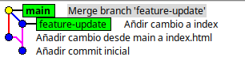

# Desarrollo de preguntas de la atividad 7

### ¿Cuándo evitarías --ff en un equipo y por qué?  
- Evitaría `--ff` cuando quiero mantener el registro de que una rama existió y se integró, en lugar de aplanar la historia.  

### Con respecto a merge --no-ff ¿Qué ventajas de trazabilidad aporta?  
- Aporta trazabilidad clara, porque cada feature queda representada por un commit de merge identificable.  

### Con respecto a merge --no-ff ¿Qué problemas surgen con exceso de merges?  
- El historial se vuelve ruidoso, con demasiados commits de merge, lo que dificulta la lectura y seguimiento.  

### Con respecto a merge --squash ¿Cuándo conviene? ¿Qué se pierde respecto a merges estándar?
- Conviene al integrar ramas con muchos commits pequeños o irrelevantes, resumiéndolos en un solo commit.  

- Se pierde el detalle de los commits individuales y no queda un commit de merge que muestre la rama original.  

## Resolver merge --no-ff con conflictos
**¿Qué pasos adicionales hiciste para resolverlo?**

- Identificar que cambios queria en `index.html` editandolo manualmente para resolver los conflictos, y luego hacer `git add` para marcar como resueltos antes de completar el merge.

**¿Qué prácticas (convenciones, PRs pequeñas, tests) lo evitarían?**

- Seguir convenciones de código claras para reducir diferencias innecesarias: Indentación y estilo uniforme, Convención en nombres de ramas,convención en organización de funciones/clases, Uso de archivos separados por responsabilidad, etc.  
- Hacer Pull Requests pequeños y frecuentes para evitar acumulación de cambios.  
- Mantener la rama actualizada con `main` o `develop` mediante rebases o merges regulares.   
- Revisar el código en equipo antes de fusionar para identificar posibles choques.

### Comparar historiales tras cada método

**¿Cómo se ve el DAG en cada caso?**
- La vista ff muestra un historial en forma de grafo de cada rama mostrando solo los primeros padres de cada commit.
- La vista solo merges muestra solo los commits resultados de merges.
- La vista completa muestra todo el historial de commits de todas las ramas.

**¿Qué método prefieres para: trabajo individual, equipo grande, repos con auditoría estricta?**
Para trabajo individual, prefiero `--ff` para mantener un historial limpio y lineal.
Para equipos grandes, prefiero `--no-ff` para mantener la trazabilidad de las ramas y los merges. También lo combinaría con `--squash` para features pequeñas y así evitar demasiados commits de merge.
Para repos con auditoría estricta, prefiero `--no-ff` para asegurar que cada cambio esté claramente documentado con un commit de merge.

**Historial visual con gitk**

### Revertir una fusión

**¿Cuándo usar git revert en vez de git reset? ¿Impacto en un repo compartido con historial público?**

- Usar `git revert` cuando el commit ya ha sido compartido con otros, ya que crea un nuevo commit que deshace los cambios sin alterar el historial.  
- Usar `git reset` para deshacer cambios en commits locales que aún no se han compartido, ya que modifica el historial.